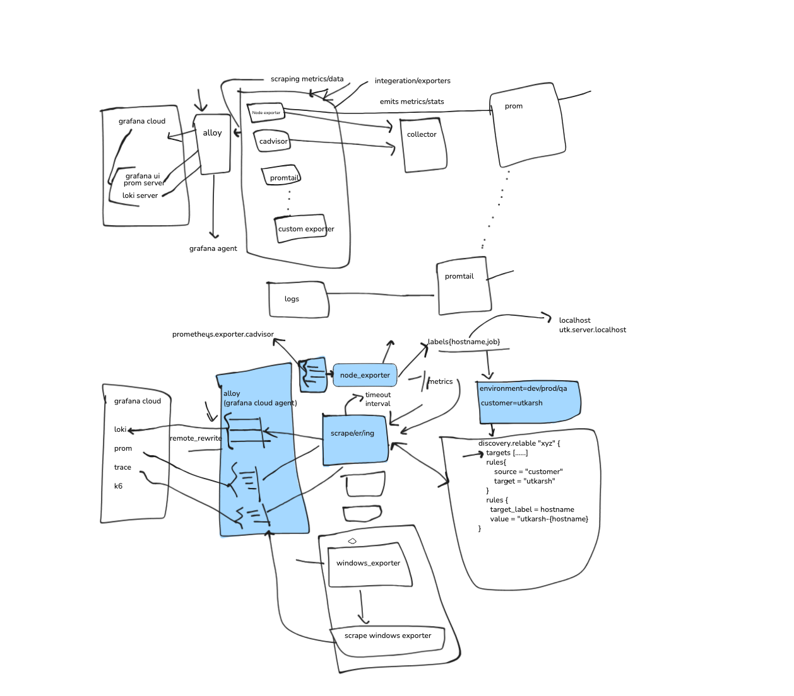

# Monitoring with Grafana Cloud

## Introduction

Monitoring is essential to ensure your applications and infrastructure are healthy, performant, and secure. Grafana Cloud provides a powerful, managed platform for monitoring metrics, logs, and traces.

---

## Why Do We Need Monitoring?

- **Detect Anomalies:** Identify abnormal behavior in applications and infrastructure.
- **Error & Exception Tracking:** Monitor errors and exceptions to improve robustness.
- **Production Readiness:** Ensure stable environments and early bug detection.
- **Proactive Actions:** Enable prompt responses to incidents and future events.

---

## What to Monitor?

- **System Metrics:** CPU, Memory, Storage, IO, Network
- **Logs:** Exceptions, Errors, Critical Events
- **Security Events:** Login attempts, Unknown IPs, Phishing, Mining, Unwanted Software, Privilege Escalation, DDoS, Brute Force
- **Application Telemetry:** Thread counts, API calls (status codes), Usage trends, Request queues, Regional availability, SSL status
- **Website Monitoring:** Synthetic checks for uptime and performance

---

## Monitoring Types

- **System Monitoring:** Track server and infrastructure health.
- **Synthetic Monitoring:** Simulate user interactions to test website availability.
- **Application Monitoring:** Observe application-level metrics and logs.

---

## Grafana Cloud Overview

Grafana Cloud is a fully managed observability platform that integrates:

- **Grafana:** Visualization and dashboarding
- **Prometheus:** Metrics collection and querying
- **Loki:** Log aggregation and querying
- **Tempo:** Distributed tracing

---

## Getting Started with Grafana Cloud

1. **Sign Up for Grafana Cloud**
    - Visit [Grafana Cloud](https://grafana.com/products/cloud/) and create a free account.

2. **Create a Stack**
    - Set up a new stack for your project/environment.

3. **Obtain API Tokens**
    - Generate API tokens for metrics, logs, and traces ingestion.

4. **Install Monitoring Agents**
    - **Prometheus Agent:** For system and application metrics.
    - **Loki Agent:** For log collection.
    - **Synthetic Monitoring:** Configure synthetic checks via the Grafana Cloud UI.

5. **Configure Data Sources in Grafana**
    - Add Prometheus and Loki as data sources in your Grafana Cloud instance.

6. **Build Dashboards**
    - Use pre-built dashboards or create custom ones to visualize your data.

7. **Set Up Alerts**
    - Configure alerting rules for critical metrics and logs.

---

## Example: System Monitoring Setup

1. **Install Prometheus Agent**
    ```sh
    curl -fsSL https://raw.githubusercontent.com/grafana/agent/release/production/install.sh | sh
    ```
    - Configure the agent with your Grafana Cloud credentials.

2. **Install Loki Agent**
    - Follow [Loki Agent documentation](https://grafana.com/docs/loki/latest/clients/promtail/).

3. **Verify Data Ingestion**
    - Check Grafana dashboards for incoming metrics and logs.

---

## Creating a Custom Prometheus Exporter

Custom exporters allow you to expose application-specific metrics to Prometheus. Here’s a simple example using Python and the [`prometheus_client`](https://github.com/prometheus/client_python) library:

1. **Install the Prometheus client library:**
    ```sh
    pip install prometheus_client
    ```

2. **Create a simple exporter:**
    ```python
    from prometheus_client import start_http_server, Gauge
    import random
    import time

    # Create a metric to track
    my_metric = Gauge('my_custom_metric', 'An example custom metric')

    if __name__ == '__main__':
        start_http_server(8000)
        while True:
            my_metric.set(random.random())
            time.sleep(5)
    ```

3. **Run your exporter:**
    ```sh
    python exporter.py
    ```

4. **Configure Prometheus Agent to scrape your exporter:**
    Add a scrape config in your Prometheus Agent configuration:
    ```yaml
    scrape_configs:
      - job_name: 'custom_exporter'
        static_configs:
          - targets: ['localhost:8000']
    ```

5. **Visualize in Grafana:**
    - After data is ingested, build dashboards in Grafana Cloud to visualize your custom metrics.

---

## Useful Resources

- [Grafana Cloud Documentation](https://grafana.com/docs/grafana-cloud/)
- [Prometheus Agent Setup](https://grafana.com/docs/agent/latest/)
- [Loki Log Collection](https://grafana.com/docs/loki/latest/)
- [Synthetic Monitoring](https://grafana.com/docs/grafana-cloud/synthetic-monitoring/)
- [Prometheus Exporter Best Practices](https://prometheus.io/docs/instrumenting/writing_exporters/)

---

## Summary

Grafana Cloud simplifies monitoring by providing a unified platform for metrics, logs, and traces. You can monitor standard system metrics and also create custom Prometheus exporters to track application-specific data. Follow the steps above to get started and ensure your systems are observable and reliable.


## Prometheus Server

Prometheus is an open-source monitoring and alerting system designed for reliability and scalability. It collects metrics from configured targets by scraping HTTP endpoints (usually `/metrics` or a user-defined path) at regular intervals.

### How Prometheus Works

- **Metrics Collection:** Prometheus server scrapes metrics from applications, services, and exporters that expose metrics in a specific format.
- **Data Storage:** Collected metrics are stored in a time-series database for efficient querying and analysis.
- **Querying:** Prometheus provides a powerful query language (PromQL) to analyze and aggregate metrics.
- **Alerting:** You can define alerting rules to notify you when certain conditions are met.

### Usage in Real Software

- **Application Monitoring:** Developers instrument their applications to expose metrics (e.g., request rates, error counts, latency) via HTTP endpoints.
- **Infrastructure Monitoring:** Exporters (like node_exporter) expose system-level metrics (CPU, memory, disk, etc.) for Prometheus to collect.
- **Custom Exporters:** Teams can build custom exporters to monitor databases, hardware, or any system with relevant metrics.

### Integration with Grafana Cloud

- **Data Source:** Grafana Cloud can connect to Prometheus (self-hosted or managed) as a data source.
- **Visualization:** Metrics collected by Prometheus are visualized in Grafana dashboards for real-time monitoring and analysis.
- **Alerting:** Alerts defined in Prometheus can be managed and routed through Grafana Cloud’s alerting system.

Prometheus is a core component of modern observability stacks, enabling teams to monitor, analyze, and respond to system health and performance issues efficiently.


## Loki
Loki is a log aggregation system designed for efficiency and scalability, purpose-built for storing and querying logs. Unlike traditional log systems, Loki indexes only metadata, making it cost-effective and fast for searching logs.

- **Log Collection:** Loki agents (like Promtail) collect logs from files, containers, or syslog and send them to Loki.
- **Label-Based Indexing:** Logs are indexed using labels (e.g., job, instance), enabling powerful queries without high storage costs.
- **Integration with Grafana:** Loki integrates seamlessly with Grafana, allowing you to visualize and correlate logs alongside metrics and traces.
- **Use Cases:** Troubleshooting application errors, auditing security events, and analyzing system behavior.

To get started, install and configure a Loki agent, point it to your log sources, and add Loki as a data source in Grafana Cloud to begin querying and visualizing your logs.


## Synthetic Monitor
Synthetic monitoring simulates user interactions with your website or API from various locations to proactively detect outages and performance issues. It helps ensure uptime, measure response times, and validate critical user journeys.

- **Types of Checks:** HTTP(s) requests, browser-based tests, DNS, TCP, ICMP (ping), SSL certificate validity.
- **Alerting:** Automatically notifies you when checks fail or performance degrades.
- **Global Coverage:** Tests can be run from multiple geographic regions to detect regional issues.
- **Use Cases:** Monitor login flows, API endpoints, shopping carts, or any critical workflow.

Grafana Cloud provides an easy-to-use UI for configuring synthetic checks and viewing results in dashboards.

### Grafana Alloy

Grafana Alloy is a flexible, open-source telemetry collector designed to unify and simplify the collection of metrics, logs, and traces. From a trainer's perspective, Alloy is valuable because:

- **Unified Agent:** It consolidates multiple data collection agents (Prometheus, Loki, etc.) into a single, manageable binary, reducing operational complexity.
- **Ease of Deployment:** Alloy can be deployed across diverse environments (VMs, containers, Kubernetes) with minimal configuration.
- **Extensible:** Supports a wide range of integrations and pipelines, making it suitable for various monitoring scenarios.
- **Learning Opportunity:** Alloy provides hands-on experience with modern observability concepts and helps teams understand how telemetry flows from source to Grafana Cloud.

